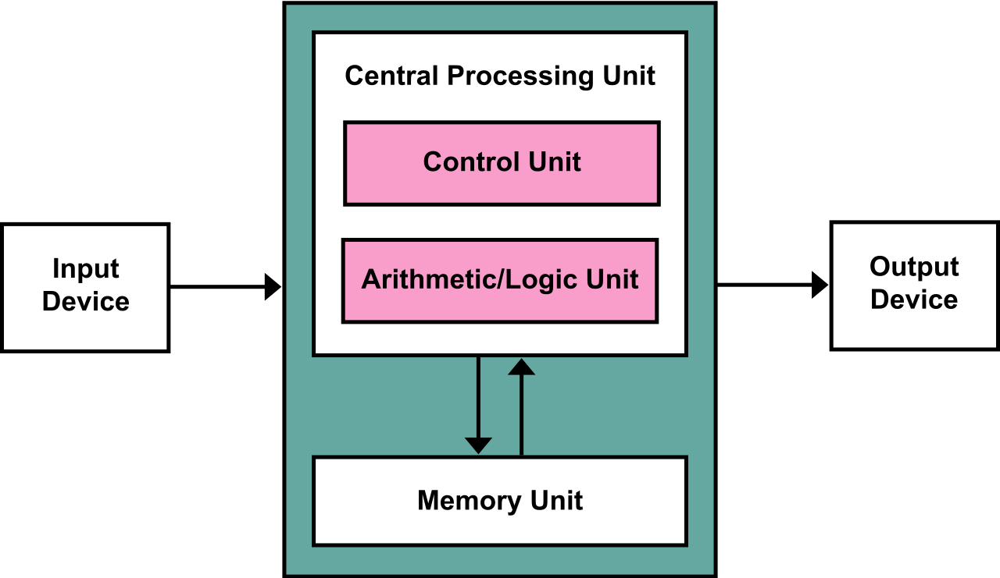
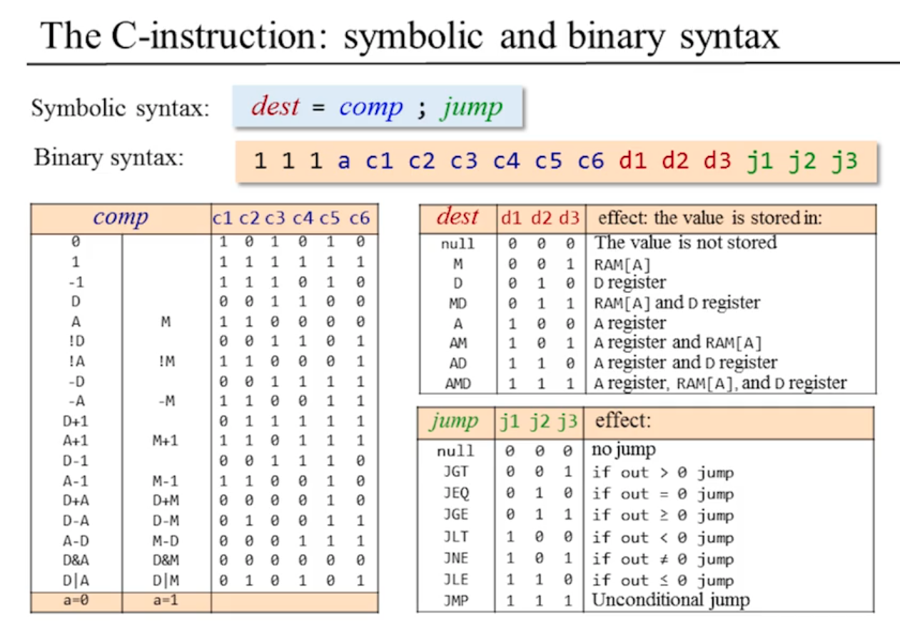
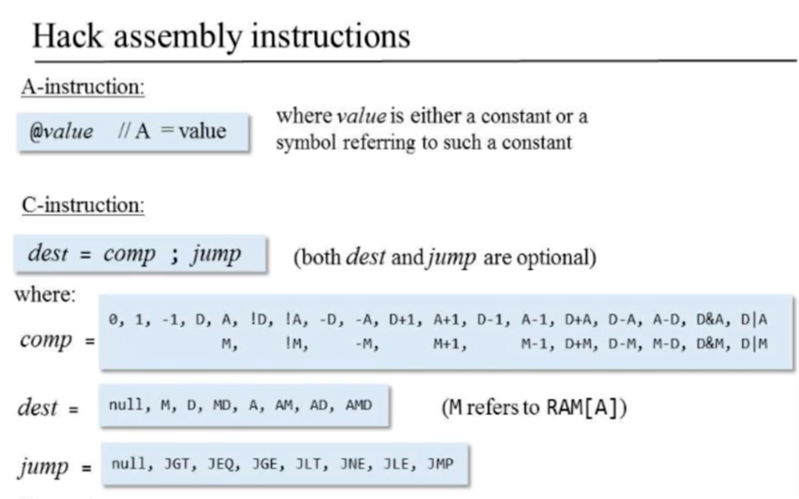
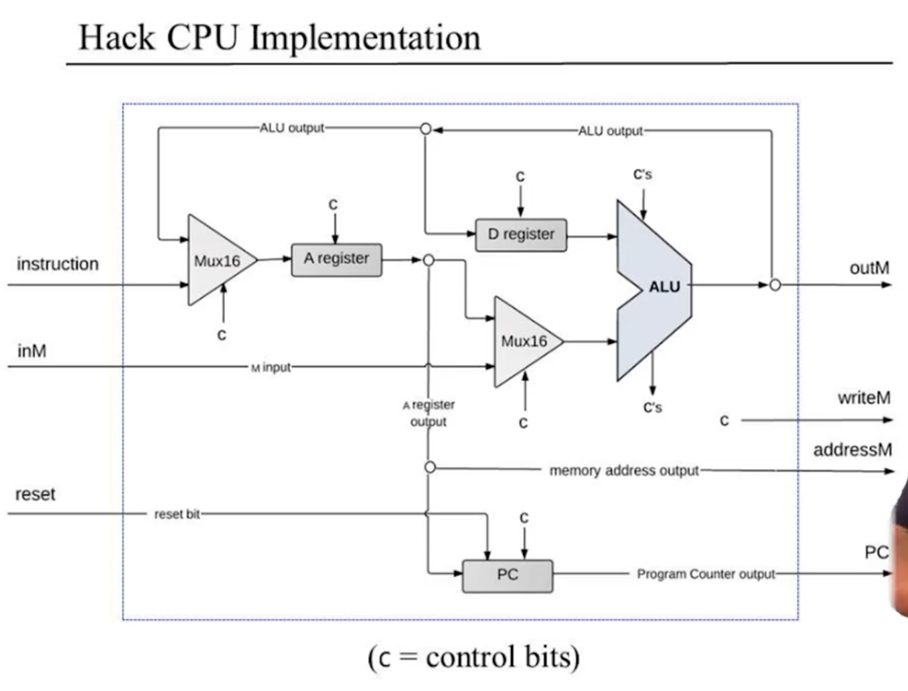

# Module 0 - Introduction

講師提出問題，為何我們在寫程式時從不擔心或思考為什麼程式會如我們預期般運行，例如print Hello World能印在terminal上。這堂課的目的就是層層拆解底層架構，當今電腦是一層又一層的abstraction堆疊而成，而我們要Bottom Up的去學習各層的知識。Part 1的學習路徑如下：

Nand -> Elementary Logic Gates -> CPU, RAM, chipset -> Computer Architecture <- Low Level Code

會使用免費的Hardward Simulator來構建一台虛擬電腦，上述各層實作的細節如下：

| Elementary logic gates | Arithmetric-Logic Unit | Registers and memory | Computer architecture | Writing low-level programs | Developing and assembler |
|------------------------|------------------------|----------------------|-----------------------|----------------------------|--------------------------|
| Nand                   | HalfAdder              | Bit                  | Memory                |                            |                          |
| Not                    | FullAdder              | Register             | CPU                   |                            |                          |
| And                    | Add16                  | RAM8                 | Computer              |                            |                          |
| Or                     | Inc16                  | RAM64                |                       |                            |                          |
| Xor                    | ALU                    | RAM512               |                       |                            |                          |
| Mux                    |                        | RAM4K                |                       |                            |                          |
| Dmux                   |                        | RAM16K               |                       |                            |                          |
| Not16                  |                        | PC                   |                       |                            |                          |
| And16                  |                        |                      |                       |                            |                          |
| Or16                   |                        |                      |                       |                            |                          |
| Mux16                  |                        |                      |                       |                            |                          |
| Or8Way                 |                        |                      |                       |                            |                          |
| Mux4Way16              |                        |                      |                       |                            |                          |
| Mux8Way16              |                        |                      |                       |                            |                          |
| DMux4Way               |                        |                      |                       |                            |                          |
| DMux8Way               |                        |                      |                       |                            |                          |

在Part 2會實作Tetris在我們build出來的虛擬電腦上。會使用一個叫Jack的語言並為他撰寫一個Compiler，也會做一個小的OS以及Standard Library。

# Module 1 - Boolean Logic

Commutative Laws:
$$(x \land y) = (y \land x)$$
$$(x \lor y) = (y \lor x)$$

Associative Laws:
$$(x \land (y \land z)) = ((x \land y) \land z)$$
$$(x \lor (y \lor z)) = ((x \lor y) \lor z)$$

Distributive Laws:
$$(x \land (y \lor z)) = ((x \land y) \lor (x \land z))$$
$$(x \lor (y \land z)) = ((x \lor y) \land (x \lor z))$$

De Morgan Laws:
$$\lnot(x \land y) = \lnot(x) \lor \lnot(y)$$
$$\lnot(x \lor y) = \lnot(x) \land \lnot(y)$$


Any Boolean function can be represented using an expression containing AND and NOT operations. (We don't need OR)



$$ (x \lor y) = \lnot(\lnot(x) \land \lnot(y)) $$


實際上我們只需要NAND Gate就能取代NOT, AND, OR


Any Boolean function can be represented using an expression containing only NAND operations.



1) $$ \lnot(x) = (x \uparrow x) $$
2) $$ (x \land y) = \lnot(x \uparrow y) $$
3) According to the previous theorem, we don't need OR.


## HDL

常見的HDL(Hardware Discribe Language)有Verilog、VHDL。

ALU是Arithmetic Logic Unit。

Add16 chip必須IN跟OUT都是16bit，舉例:

Bus1、Bus2、out2 都是 16bit 時：

1. 合法
   ```hdl
   Add16(a=Bus1, b=Bus2, out=out2);
   ```

2. 不合法
   ```hdl
   Add16(a=Bus1, b=Bus2, out=out2[0..14]);
   ```

3. 合法
   ```hdl
   Add16(a=Bus1, b=Bus2, out[0..14]=out2[0..14]);
   ```

# Module 2 - Boolean Arithmetic and the ALU

## 2's Complement Representattion

以4-bit舉例，正數從 1 到 7，負數從 -1 到 -8。原因是如果用高位當作正負號的sign，會要maintain 0000 跟 1000 都為 0 的狀況。

n-bit 2's complement 範圍：

| | 範圍 |
|---|---|
| Positive | $0 \sim 2^{n-1}-1$ |
| Negative | $-2^{n-1} \sim -1$ |

公式：$-x = 2^{n} - x$

e.g. 4-bit：$-5 = 2^4 - 5 = 11 = (1011)_2$

在硬體上的實作，idea如下

$-x = 2^{n} - x = 1 + (2^{n} - 1) - x$

以4-bit為例，$2^{n} - 1$代表$(1111)_2$，做減法非常簡單，不需要借位。而最後的加1也非常簡單，從右邊開始做flip，直到遇到第一個0。

e.g. 4-bit：

$$
\begin{aligned}
-6 &= 2^4 - 6 \\
   &= 1 + (2^4 - 1) - 6 \\
   &= 1 + (1111)_2 - (0110)_2 \\
   &= 1 + (1001)_2 \\
   &= (1010)_2
\end{aligned}
$$

## ALU

| function | definition                               | explain                            |
|----------|------------------------------------------|------------------------------------|
| zx       | if zx <br> then x=0                      | pre-setting the x input            |
| nx       | if nx <br> then x=!x                     | pre-setting the x input            |
| zy       | if zy <br> then y=0                      | pre-setting the y input            |
| ny       | if ny <br> then y=!y                     | pre-setting the y input            |
| f        | if f <br> then out=x+y <br> else out=x&y | selecting between computing + or & |
| no       | if no <br> then <br> out=!out             | post-setting the output            |

範例一：  
x = 0, zx = 1, nx = 1  
則 x = 0，然後 x = !0，如果是 4-bit 就會變成 $(1111)_2$  

1-bit contorl output 的功用是紀錄 out 的訊息，定義如下：
```text
if out == 0 then zr = 1, else zr = 0
if out < 0  then ng = 1, else ng = 0
```

# Module 3 - Memory

DFF: 每個clock都會更新。
1-Bit Register: 只有 load=1 時才會更新。

1-Bit Register 可以用 Mux + DFF 組出來。

1-Bit Register 當 load=0 時，會把當前的 out 送成 DFF 下一拍的 in（用 Mux 做選擇），目的是保存舊值不遺失。

+ Von Neumann Architecture


DFF (D Flip Flop) 的唯一功能就是把這一拍的 bit 帶到下一拍。

實作HDL心得：它的邏輯有時跟我們平常寫程式的慣性相反，例如if elif else常會需要從最下面的邏輯往上實作。另外高位階與低位階的數字與array相反，例如address[3]代表3-bit combination，例如address=(001)，此時要取1反而要用address[0]。

# Module 4: Machine Language

1. Program: instruction的組合，instruction會告訴computer要做什麼事
2. 哪個instruction需要給computer，例如執行instruction 74，但接下來可能要執行instruction 125
3. 需要讓computer知道要從哪去拿資料，例如 a+b -> 需要知道 a 跟 b 在哪

Assembler: 將Assemble Code編譯為Machine Code。

Memory Hierarchy:  
因為access memory cost高昂，因此將memory分層為 Registers -> Cache -> Main Memory -> Disk。

+ CPU通常包含了一些Registers，種類有
   + Data Registers: 進行簡單運算例如 - Add R1, R2
   + Address Registers: 把資料存入 - Store R1, @A
+ Addressing Modes
   + Register : Add R1, R2     // R2 <- R2 + R1
   + Direct   : Add R1, M[200] // Mem[200] <- Mem[200] + R1
   + Indirect : Add R1, @A     // Mem[A] <- Mem[A] + R1
   + Immediate: Add 73, R1     // R1 <- R1 + 73

IN/OUT:  
常見的input有滑鼠、鍵盤、印表機之類，用driver讓電腦知道怎麼透過protocal跟他們溝通

Flow Controll:  
通常是按順序執行，但有時需要跳，例如For Loop（Unconditional Jump）或 If statement（Conditional Jump）

## Hack Computer

- The A-instruction
  - @開頭的指令，例如底下的@100，意思是把100的值放入A Register裡

    ```asm
    // Set RAM[100] to -1
    @100  // A=100
    M=-1  // RAM[100]=-1
    ```
- The C-instruction
  - $$dest = comp ; jump$$
  - 上述的 M=-1 就是一個C-instruction，代表在RAM的第100格放入-1

可以用查表的方式構築C-instruction



## Input/Out

Screen Memory Map:

1. To set pixel (row, col) on/off:
   1. i = 32*row + col/16
      1. word = Screen[32*row + col/16]
      1. word = RAM[16384 + 32*row + col/16]
   2. Set the (col%16)th bit of word to 0 or 1
   3. Commit word to the RAM
2. 這堂課中 Screen 是一種 chip
3. Hack Computer中的RAM[0..16384]是一般記憶體，16384之後才是給Screen的

不只螢幕會佔用一部分RAM，鍵盤也會佔用RAM（keyboard memory map），但只用了16-bit

舉例：如果我按了K，可能對應到的memory code是75 (0000000001001011)_16、空白鍵是32 (0000000000100000)_16 ... 等等

Keyboard memory map 位置 RAM[24576]（Symbolic: @KBD）

按下按鍵的時候會輸入對應到value例如75，放開按鍵時會輸入0

## Hack Programming

兩個instructions概括


之後會實作Assembler（一種translator）將Assembly轉譯成Machine Code，但在那之前我們會用課程提供的CPU Emulator來寫程式

有些高階語言會先轉譯成Assemble再轉譯成Machine Code，有些不會
+ C/C++
   + `C/C++ -> compiler -> assembly -> assembler -> machine code`
+ Go
   + `Go -> compiler/toolchain -> machine code`
+ Python
   + `Python source -> bytecode -> Python VM/interpreter`
+ Java
   + `Java -> bytecode (.class) -> JVM`

# Module 5: Computer Architecture

## Von Neumann Architecture

三種資訊流: address bus / control bus / data bus  
先給 address，然後幾乎同時給 control，才能決定 data 要往哪流

Register 存了 Addresses 跟 Data 的資訊

Memory 內有兩種 type: Data memory & Program memory  
其中 Program memory 存的是 instructions；data memory 存的是程式要操作的資料  

## The Fetch-Execute Cycle

Fetch execute clash 是發生在 Memory 只有一個 port，但 instruction memory 跟 data memory 都要同時取用時

Harvard Architecture 對此的解法是將兩個 memory 分離

## Central Processing Unit



e.g.  
instruction = (  
   @100  
   D=M  
   @10
   M=-1  
)  

1. @100流入A register並被存入，因為這是A-instruction，所以writeM=0，不會有outM產生
2. D=M進來，因為是C-instruction，因此不會被A register存入。同時因為之前A有地址了，因此 inM=RAM[A] 會流進來，然後經過ALU後寫入D register裡
3. @10流入A register，把舊的值 100 替代俵，變成 10
4. M=-1會導致CPU直接產生outM=-1，同時也產生了writeM=1、addressM=10，因此memory寫入RAM[10]=-1
   1. 在這一步 inM=RAM[10] 會存在，但用不到

reset的功能就是把PC重設回起點，讓CPU從instruction的第一條開始執行

## The Hack Computer

闡述了Hack Computer Architecture的細節  
Instruction Memory / CPU / Data Memory  

Data Memory 前 16K 左右是放資料的，16K~24K是螢幕，最後一個register給鍵盤  
CPU跟前一章節一樣  
Instruction Memory 是在Hack架構下是 ROM32K

## Porject

這邊做CPU中的Program Counter時我覺得簡化的過程很有趣，特此紀錄

```
isCinstruction AND (
  (j1=0 AND j2=0 AND j3=1 AND zr=0 AND ng=0) OR
  (j1=0 AND j2=1 AND j3=0 AND zr=1) OR
  (j1=0 AND j2=1 AND j3=1 AND (zr=1 OR (zr=0 AND ng=0))) OR
  (j1=1 AND j2=0 AND j3=0 AND ng=1) OR
  (j1=1 AND j2=0 AND j3=1 AND zr=0) OR
  (j1=1 AND j2=1 AND j3=0 AND (zr=1 OR ng=1)) OR
  (j1=1 AND j2=1 AND j3=1)
)

# 2
isCinstruction AND (
  (j1=0 AND j2=0 AND j3=1 AND zr=0 AND ng=0) OR
  (j1=0 AND j2=1 AND j3=0 AND zr=1) OR
  (j1=0 AND j2=1 AND j3=1 AND zr=1) OR
  (j1=0 AND j2=1 AND j3=1 AND zr=0 AND ng=0) OR
  (j1=1 AND j2=0 AND j3=0 AND ng=1) OR
  (j1=1 AND j2=0 AND j3=1 AND zr=0) OR
  (j1=1 AND j2=1 AND j3=0 AND zr=1) OR
  (j1=1 AND j2=1 AND j3=0 AND ng=1) OR
  (j1=1 AND j2=1 AND j3=1)
)

# 3 
isCinstruction AND (
  (001 AND notZero AND notNegative) OR
  (010 AND isZero) OR
  (011 AND isZero) OR
  (011 AND notZero AND notNegative) OR
  (100 AND isNegative) OR
  (101 AND notZero) OR
  (110 AND isZero) OR
  (110 AND isNegative) OR
  (111)
)

# 4
isCinstruction AND (
  (001 AND isPositive) OR
  (010 AND isZero) OR
  (011 AND isZero) OR
  (011 AND isPositive) OR
  (100 AND isNegative) OR
  (101 AND notZero) OR      # notZero = isPositive OR isNegative
  (110 AND isZero) OR
  (110 AND isNegative) OR
  (111 AND (isPositive OR isZero OR isNegative))
)

# 5
isCinstruction AND (
  (001 AND isPositive) OR
  (011 AND isPositive) OR
  (101 AND isPositive) OR
  (111 AND isPositive) OR

  (010 AND isZero) OR
  (011 AND isZero) OR
  (110 AND isZero) OR
  (111 AND isZero) OR

  (100 AND isNegative) OR
  (101 AND isNegative) OR
  (110 AND isNegative) OR
  (111 AND isNegative)
)

# 6
isCinstruction AND (
  ( isPositive AND (001 OR 011 OR 101 OR 111) ) OR
  ( isZero     AND (010 OR 011 OR 110 OR 111) ) OR
  ( isNegative AND (100 OR 101 OR 110 OR 111) )
)

# 7
# 這邊能簡化成j1, j2, j3是因為各別把他們拿掉後，剩下的兩個bits涵蓋所有可能: 00, 01, 10, 11，且又是OR相連，因此使用一個bit即可
isCinstruction AND (
  ( isPositive AND j3 ) OR
  ( isZero     AND j2 ) OR
  ( isNegative AND j1 )
)

# 8
instruction[15] AND (
  ( zr=0 AND ng=0 AND j3 ) OR
  ( zr=1 AND j2 ) OR
  ( ng=1 AND j1 )
)
```

# Module 6: Assembly

目的: 學習如何將 Assembly Language 轉為 Machine Language

基本Assembler邏輯:  
Repeat以下:  
1. 讀下一行
2. 拆成不同part，例如 $$Load R1, 18$$ -> $$Load$$, $$R1$$, $$18$$
3. 查binary表，例如 $$11001$$ / $$01$$ / $$000010010$$
4. 將對應的binary重新組合，例如 $$1100101000010010$$
5. Output步驟4的result

需要維護一張Symbol Table來記住變數跟address的關係，以及loop該跳去哪個address

## The Hack Assembly Language

A-instruction: @21 -> 0000000000010101 （注意第一個0，是由@直譯過來）  
C-instruction: dest = comp ;jump ，需要查表

tip: 晚點再處理symbol

Symbols有以下三類
1. variable symbols
   1. e.g. @i / @sum
   2. Hack架構下，variable都是從address=16開始存
2. label symbols
   1. e.g. LOOP / STOP / END
   2. 通常被 () 包起來
3. pre-defined symbols
   1. R0=0, R1=1, ... R15=15, SCREEN=16384, KBD=24576
   2. SP=0, LCL=1, ARG=2, THIS=3, THAT=4

建構 Symbol Table:
1. Init - 建構一個empty table，然後把 pred-defined symbols 都load進去
2. First pass - 掃描整個program，把帶有 () 的 label symbols 加進去 -> (symbol, address)
3. Second pass - 再次掃描整個program，把 var symbols 加進去
   1. 如果是 @symbol，先查table - 有值就取，沒值就update table -> (symbol, n) 且 n++
   2. 如果是C-instruction，直接翻譯並寫入output file

## Implementation

可以用任何high-level language實作，但建議follow以下架構:
1. Parser      : unpacks each instruction into its underlying fields
2. Code        : translate each field into its corresponding binary value
3. SymbolTable : manages the symbol table
4. Main        : initializes the I/O files and drives the process

範例: java HackAssembler Xxx.asm  
預期產出: 能被 Hack computer 執行的 Xxx.hack，且上述指令執行後會create/override Xxx.hack

我的理解是四個function/class

具體pesudocode如下  
```java
// Assume that current command is
//      D = M+1; JGT
String c = parser.comp();  // "M+1"
String d = parser.dest();  // "D"
String j = parser.jump();  // "JGT"

String cc = code.comp(c);  // "1110111"
String dd = code.dest(d);  // "010"
String jj = code.jump(j);  // "001"

String out = "111" + cc + dd + jj;
```
