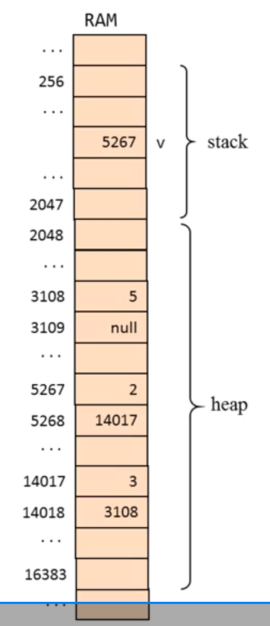
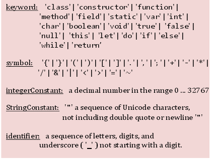
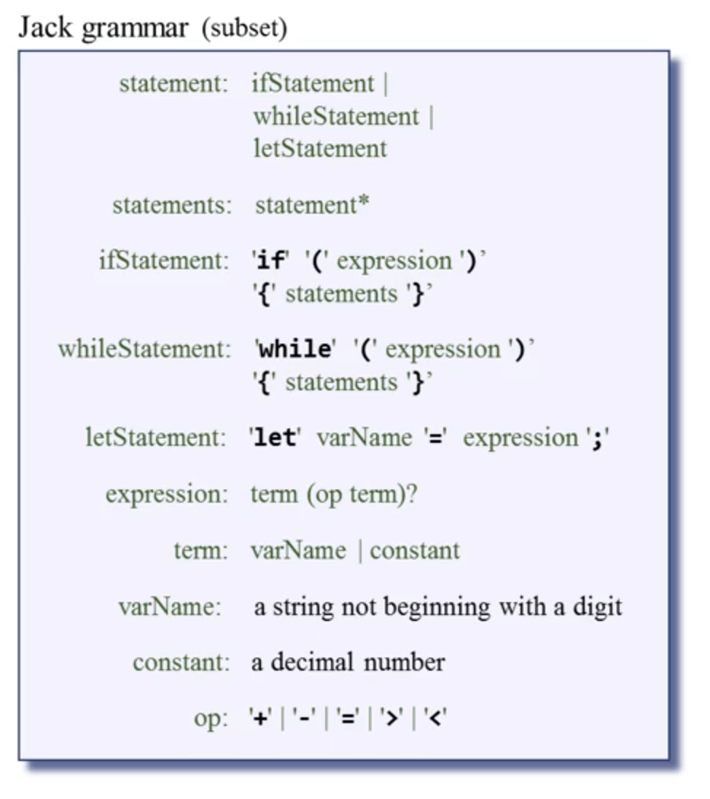

# Unit 1 - VM - Stack Arithmetric

VM是Stack Machine，主因是這樣VM跟Compiler都會變得簡潔，我認為是課堂需要。

Memory Segment將Memory切成數個區塊存放不同類別的資料例如 argument, local, static, constant

這堂課有八個virtual memory segment： local / argument / this / that / constant / static / pointer / temp

要注意 push xxx 1 是指複製 xxx 的數值到 stack，並不會消滅它 (xxx 不包含 constant)

pop xxx 2 是指從 stack 的頂層拿出數值後assign到 xxx 的 index 2 中 (xxx 不包含 constant)

## Pointer

D = *p 等價於下列三行:  
@p  
A=M  
D=M  

p-- 等價於 p = p - 1  
如果 RAM index p 的 value 是 257，那 p-- 後，該 value 會變 256

如果 RAM index q 的 value 是 1024，那 *q = 9 則是將 RAM index 1024 的 value 改成 9  
如果下一行執行 q++，則代表 RAM index q 的 value +1，也就是 1025

但題目又有點把我搞混，題目如下:

RAM[256] = 22
RAM[257] = 31
RAM[258] = 200
RAM[259] = 28

求:  
1  p1 = 256
2  p1 = p1 + 3
3  *p1 = *p1 + 3
4  p2 = p1 - 2
5  p1--
6  *(p2 + 1) = *p1 + *p2

第2行 -> p1 = 259  
第3行 -> *p1 = RAM[259] + 3 = 31 -> 代表寫31回RAM[259]  
第4行 -> p2 = 257  
第5行 -> p1 = 256  
第6行 -> *(p2+1) = *258 = *p1 + *p2 = 31 + 200 = 231 -> 代表寫231回RAM[258]  

看起來*p的意思就是要把資料寫進該address

*SP = 17  
SP++  

等價於下列:  
@17  // D=17  
D=A  
@SP  // *SP=D  
A=M  
M=D  
@SP  // SP++  
M=M+1  

## Memory Segment

1. Local - LCL
    1. LCL只記得base address，接著依序存放資料
    2. local有三個資料7, -91, 3，假設base address是1015，則RAM[1015]=7, RAM[1016]=-91, RAM[1017]=3
2. local / argument / this / that
    1. object -> this
    2. array -> that
    3. 上述四個都是有 base address，然後再依序取資料
    4. push 實作: addr = segmentPointer + i, *SP = *addr, SP++ (基本上push就是放到stack)
    5. pop 實作: addr = segmentPointer + i, SP--, *SP = *addr
3. constant
    1. 只有 push，沒有 pop
    2. *SP = i, SP++
4. static
    1. 他是全域變數，因此無法像上述segment可以dynamic的放在RAM裡
    2. 語法: static 5 -> @Foo.5
    3. 這堂課裡會把static放在RAM[16] ~ RAM[255]
5. temp
    1. Hack VM提供8個temp variables，RAM[5] ~ RAM[12]
    2. push 實作: addr = 5 + i, *SP = *addr, SP++
    3. pop 實作: addr = 5 + i, SP--, *SP = *addr
6. pointer
    1. 持續追蹤 this 跟 that 用，在compiler中比較能體現它的用處
    2. pointer 0 <=> THIS
    3. pointer 1 <=> THAT
    4. push 實作: *SP = THIS/THAT, SP++
    5. pop 實作: SP--, THIS/THAT = *SP
    6. "that7" = RAM[THAT + i]

## VM translator

VM translator目的是把VM code轉譯成Assembly Code

Unit 1的project先實作以下部分:

Arithmetic / Logical commands:  
`add`  
`sub`  
`neg`  
`eq`  
`gt`  
`lt`  
`and`  
`or`  
`not`  

Memory access commands:  
`pop segment i`  
`push segment i`  

# Unit 2 - VM - Program Control

## Branching

三種VM branching commands
1. label  
2. goto  
3. if-goto  

沒有branching，instructions就是從上而下。有了branching，instruction的執行順序就能跳來跳去的

+ Unconditional Branching
+ Conditional Branching

## Function
  
e.g. caller
```console
function main 0
    push constant 3
    push constant 8
    push constant 5
    call mult 2
    add
    return
```

e.g. callee
```
function mult 2
    push constant 0
    pop local 0
    push constant 1
    pop local 1
label LOOP
    push local 1
    push argument 1
    // ... computes the product into local 0
label END
    push local 0
    return
```

這邊mult 2代表callee這邊會init兩個LOCAL memory address  
例如 LOCAL 0 = result  
LOCAL 1 = counter  
然後caller丟的argument會存在ARGUMENT  
ARGUMENT 0 = 8  
ARGUMENT 1 = 5  

此時 counter 會執行回圈直到 ARGUMENT 1 = 5次，然後每次 result 會加上 ARGUMENT 0 = 8  

push constant 0 / pop local 0 代表把 local 0 = 0，通常要存乘法的結果。  
可以想像成 result = 0，然後進行以下步驟：
```
result = 0
result = result + 8
result = result + 8
result = result + 8
result = result + 8
result = result + 8
```

push constant 1 / pop local 1 代表把 local 1 = 1，通常是當counter，等local 1 = 6 時就停止。

### Function Call

當我們 call function 時，有些caller's frame需要被存起來。

以上述的例子:
```console
function main 0
    push constant 3  // working stack of the caller
    push constant 8  // argument 0
    push constant 5  // argument 1
    call mult 2
    add
    return
```

然後會額外儲存
saved LCL：恢復 caller 原本的 local segment  
saved ARG：恢復 caller 原本的 argument segment  
saved THIS：恢復 caller 原本的 THIS   
saved THAT：恢復 caller 原本的 THAT  

### Call的實作

假設要實作 mult 2
```
...
8                  <- mult 的 argument 0  // ARG
5                  <- mult 的 argument 1
return address
saved LCL
saved ARG
saved THIS
saved THAT
                    <- SP現在在這  // LCL
```

這些建造出來後，會計算  
ARG = SP - 5 - nArgs  // 在這邊是 2  
LCL = SP  

ARG的目的是讓function知道自己的各個segment位置  
LCL SP的目的是LOCAL segment的起始位置，這樣才能開始init LOCAL 0, LOCAL 1 等  

e.g.2.

假設有 function foo 4，代表會建立 LOCAL 0 ~ 3  
call foo 2，代表會先push兩個constant到stack再建立那些必要的segment  
```
push constant 5  // ARG
push constant 8
call foo 2
return address
saved LCL
saved ARG
saved THIS
saved THAT
LOCAL 0 = 0
LOCAL 1 = 0
LOCAL 2 = 0
LOCAL 3 = 0
SP
```

### Return的實作

```
endFrame = LCL            // endFrame is a temporary variable
retAddr = *(endFrame - 5) // gets the return address
*ARG = pop()              // Repositions the return value for the caller
SP = ARG + 1              // Repositions SP of the caller
THAT = *(endFrame - 1)    // Restores THAT of the caller
THIS = *(endFrame - 2)    // Restores THIS of the caller
ARG = *(endFrame - 3)     // Restores ARG of the caller
LCL = *(endFrame - 4)     // Restores LCL of the caller
goto retAddr              // goes to return address in the caller's code
```

## VM translator

function Foo.main -> (Foo.main)  
function Foo.bla -> (Foo.bla)  

+ Main
    + fileName.vm -> fileName.asm
    + directoryName -> 含一個或多個 .vm files -> 全部compile成 .asm files
+ Parser
    + 跟 project7 一樣，但要多 handle goto / if-goto / label / call / fucntion / return
+ CodeWriter
    + API
        + setFileName - fileName(string)
        + writeInit
        + writeLabel - label(string)
        + writeGoto - label(string)
        + writeIf - label(string)
        + writeFunction - functionName(string) / numVars(int)
        + writeCall - functionName(string) / numArgs(int)
        + writeReturn

# Unit 3 - Jack Language

本章學習 Jack Language 的特性。Jack Language 不是重點，重點是學習如何建構一個語言，後續會實作compiler去compile它。

Hello World
```jack
/** Hello World program. */
class Main {
    function void main() {
        /* Prints some text using the standard library. */
        do Output.printString("Hello World!");
        do Output.println();
        return;
    }
}
```

+ Comments:
    + /** API block comment */
    + /* block comment */
    + // in-line coment
+ White space (ignored)

Procedural processing
```jack
// Inputs some numbers and compputes their average
class Main {
    function void main() {
        var Array a;
        var int length;
        var int i, sum;
        let length = keyboard.readInt("How many numbers? ");
        let a = Array.new(length); // constructs the array
        let i = 0;
        while (i < length) {
            let a[i] = keyboard.readInt("Enter a number: ");
            let sum = sum + a[i];
            let i = i + 1;
        }
        do Output.printString("The average is ");
        do Output.printInt(sum / length);
        return;
    }
}
```

+ Main class 一定得存在
+ Main class 至少要有一個function叫main
+ Program's entry point Main.main
+ Arrays
    + Array is implemented as part of the standard class library
    + Jack Array沒有type，意思是塞什麼進去都行
+ Jack data types:
    + Primitive
        + int
        + char
        + boolean
    + Class types
        + OS: array, String, ...
        + Program extensions: as needed

因為 Jack 只有 int/char/boolean，因此會需要OO programming來定義一些type例如 fractions

## OO programming: building a API

+ Fraction API
```jack
class Fraction {
    /** Constructs a (reduced) fraction from the given numerator and denominator */
    constructor Fraction new(int x, int y)

    /** Accessors. */
    method int getNumerator()
    method int getDenominator()

    /** Returns the sum of this fraction and the other one. */
    method Fraction plus(Fraction other)

    /** Disposes this fraction. */
    method void dispose()

    /** Prints this fraction in the format x/y. */
    method void print()
}
```

+ Example of using Fraction API
```jack
class Main {
    function void main() {
        var Fraction a, b, c;
        let a = Fraction.new(2, 3);
        let b = Fraction.new(1, 5);
        let c = a.plus(b);
        do c.print();
        return;
    }
}
```

## OO programming: building a class (Abstract)

+ Fraction class
```jack
/** Represents the Fraction type and related operations. */
class Fraction {

    field int numerator, denominator;

    /** Constructs a (reduced) fraction from the given numerator and denominator. */
    constructor Fraction new(int x, int y) {
        let numerator = x;
        let denominator = y;
        do reduce();
        return this;
    }

    // Reduces this fraction.
    method void reduce() {
        var int g;
        let g = Fraction.gcd(numerator, denominator);
        if (g > 1) {let numerator = numerator / g; let denominator = denominator / g;}
        return;
    }

    // Computes the greatest common divisor of the given integers.
    function int gcd(int a, int b) {
        var int r;
        while (~(b = 0)) {                // applies Euclid's algorithm.
            let r = a - (b * (a / b));    // r = remainder of the integer division a/b
            let a = b; let b = r; }
        return a;
        }
    }

    /** Accessors. */
    method int getNumerator() {
        return numerator;
    }

    method int getDenominator() {
        return denominator;
    }

    /** Returns the sum of this fraction and the other one. */
    method Fraction plus(Fraction other) {
        var int sumNumerators;
        let sumNumerators = (numerator * other.getDenominator()) +
                            (other.getNumerator() * denominator);
        return Fraction.new(sumNumberators, denominator * other.getDenominator());
    }

    /** Prints this fraction in the format x/y. */
    method void print() {
        do Output.printInt(numerator); do Output.printString("/");
        do Output.printInt(denominator);
        return;
    }

    /** Disposes this fraction. */
    method void dispose() {
        do Memory.deAlloc(this);
        return;
    }
}  // Fraction class
```

Dispose 在 Jack 中是必要的因為 Jack 沒有 GC。

## List processing

這堂課的List是用linked-list style呈現

(2, (3, (5, null))) -> commonly abbreviated as (2, 3, 5)

+ List API
```jack
/** Represents a linked list of integers. */
class List {
    /** Creates a List */
    constructor List new(int car, List cdr)

    /** Prints this list */
    method void print() {}

    /** Disposes this list */
    method void dispose() {}
}
```

+ Main
```jack
// Build, prints, and dispose a list
class Main {
    function void main() {
        // Creates and manipulates the list (2, (3, (5, null))),
        // commonly referred to as (2,3,5)
        var List v;
        let v = List.new(5, null);
        let v = List.new(3, v);
        let v = List.new(2, v);
        do v.print();
        do v.dispose();  // disposes the list
        return;
    }
}
```

+ List class
```jack
class List {
    field int data;  // a list consists of a data field,
    field List next; // followed by a list.

    /* Creates a List. */
    constructor List new(int car, List cdr) {
        let data = car;
        let next = cdr;
        return this;
    }

    /** Prints this list. */
    method void print() {
        var List current;
        let current = this;
        while (~(current == null)) {
            do Output.printInt(current.getData());
            do Output.printChar(32);  // prints a space
            do current = current.getNext();
        }
        return;
    }

    /** Disposes this list */
    // by recursively disposing its tail
    method void dispost() {
        if (~(next == null)) {
            do next.dispost()
        }
        // Uses an OS routine to recycle this list
        do Memory.deAlloc(this);
        return;
    }
}
```

List在RAM中這樣存



## Jack Syntax

| Syntax | Description |
| --- | --- |
| `class`, `constructor`, `method`, `function` | Program components |
| `int`, `boolean`, `char`, `void` | Primitive types |
| `var`, `static`, `field` | Variable declarations |
| `let`, `do`, `if`, `else`, `while`, `return` | Statements |
| `true`, `false`, `null` | Constant values |
| `this` | Object reference |

## Jack Symbols

| Symbol | Description |
| --- | --- |
| `()` | Used for grouping arithmetic expressions and for enclosing parameter-lists and argument-lists |
| `[]` | Used for array indexing |
| `{}` | Used for grouping program units and statements |
| `,` | Variable list separator |
| `;` | Statement terminator |
| `=` | Assignment and comparison operator |
| `.` | Class membership |
| <code>+</code>, <code>-</code>, <code>*</code>, <code>/</code>, <code>&amp;</code>, <code>&#124;</code>, <code>~</code>, <code>&lt;</code>, <code>&gt;</code> | Operators |

## Type conversions

1. Char跟Int可以互換
```jack
var char c;
let c = 65;  // 'A'
// Equivalently:
var String s;
let s = "A";
let c = s.charAt(0);
// Note that the idiom c = 'A' is not supported by the Jack language
```

2. Int可以當作memory address被assigned
```jack
var Array arr;     // creates a pointer variable
let arr = 5000;    // sets arr to the memory address 5000
let arr[100] = 17; // sets memory address 5100 to 17
```

3. Object可以被轉成Array，反之亦然
```jack
var Fraction x; // a Fraction object has two int fields: numerator and denominator.
var Array arr;
let arr = Array.new(2);
let arr[0] = 2;
let arr[1] = 5;
let x = arr;    // sets x to the base address of the memory block representing the array [2, 5]
do x.print();   // will print 2/5
```

## Classes

之前在 Fraction 做的 gcd 可以抽到 `Math` class 當 Library 來用

+ Jack Standard Library

| OS class | Services |
| --- | --- |
| `Math` | Common mathematical operations: `multiply(int, int)`, `sqrt(int)`, etc. |
| `String` | Represents string objects and related methods: `length()`, `charAt(int)`, etc. |
| `Array` | Represents array objects and related operations: `new(int)`, `dispose()`. |
| `Output` | Supports text output to the screen:<br>`printString(String)`, `printInt(int)`, `println()`, etc. |
| `Screen` | Supports graphics output to the screen: `drawPixel(int, int)`, `setColor(boolean)`, `drawCircle(int, int, int)`, etc. |
| `Keyboard` | Supports input from the keyboard: `readLine(String)`, `readInt(String)`, etc. |
| `Memory` | Facilitates access to the host RAM:<br>`peek(int)`, `poke(int, int)`, `alloc(int)`, `deAlloc(Array)`. |
| `Sys` | Supports execution-related services: `halt()`, `wait(int)`, etc. |

## Methods

一段可被呼叫、可重複利用的程式稱為subroutines

+ Constructors
    + 0, 1 or more in a class
    + Common name: new
    + The constructor's type must be the name of the constructor's class
    + The constructor must return a reference to an object of the class type
+ Variables
    + static / field / local / prarmeter
+ Statement
    + let / if / while / do / return
+ Expressions
    + A constant / A variable name in scope / this / Arr[expression] / A subroutine call
    + `-` or `~`
    + `()`
+ Strings
+ Arrays
    + 在Jack中array不是個type，是個object
    + multi-array要在array中塞array
+ Peculiar Features
    + let - must be used in assignments: `let x = 0;`
    + do - must be used for calling a method or a function outside an expression: `do reduce();`
    + Body of statement 必須包在 brackets: `if (a > 0) {return a} else {return -a};`
    + All subroutine must end with a `return`
    + 沒有先乘除後加減: 不能 `2 + 3 * 4`，在Jack必須寫成 `2 + (3 * 4)`
    + Jack is weakly typed

# Unit 4 - Compiler I: Syntax Analysis

## Tokenizing

+ 看起來像是把code切開by whitespace
+ Token的定義 - A token is a string of characters that has a meaning
+ Token有以下類別
    + Keyword
    + Symbol
    + intergenConstant
    + StringConstant
    + identifier



e.g.
```jack
if (x < 0) {
    // prints the sign
    let sign = "negative";
}
```

outptu:
```bash
<keyword> if </keyword>
<symbol> ( </symbol>
<identifier> x </identifier>
<symbod> < </symbol>
<intConst> 0 </intConst>
...
```

## Grammar



## Parser Logic

Parse是一個recursion，底下演示一個 while 語句如何轉換為 XML。  
`while ( count < 100 ) { let count = count + 1 ; }`
```xml
<whileStatement>
    <keyword> while </keyword>
    <symbol> ( </symbol>
    <expression>
        <term>
            <identifier> count </identifier>
        </term>
        <symbol> < </symbol>
        <term>
            <integerConstant> 100 </integerConstant>
        </term>
    </expression>
    <symbol> ) </symbol>
    <symbol> { </symbol>
    <statements>
        <letStatement>
            <keyword> let </keyword>
            <identifier> count </identifier>
            <symbol> = </symbol>
            <expression>
                <term>
                    <identifier> count </identifier>
                </term>
                <symbol> + </symbol>
                <term>
                    <integerConstant> 1 </integerConstant>
                </term>
            </expression>
            <symbol> ; </symbol>
        </letStatement>
    </statements>
    <symbol> } </symbol>
</whileStatement>
```

這邊使用 LL grammar，然後做 LL(1)，意思是一次只往前看一個

## Jack grammar

e.g.  
`parameterList: ( ( type varName )   ( ‘,’ type varName ) * ) ?`

這邊的意思是  
1. (...)? 代表括號內可以出現0或1次，因此 `foo()` 這樣的function是能被解析的
2. (type varName) 代表可以長這樣 `int x`
3. (',' type varName)* 代表後面可接 0 ~ N 個參數
    1. 例如: (int x, int y) / (int x, int y, boolean flag) / etc

### Lexical Elements

The Jack language includes five types of terminal elements, or tokens.

| Element | Rule |
|---|---|
| `keyword` | `'class' \| 'constructor' \| 'function' \| 'method' \| 'field' \| 'static' \| 'var' \| 'int' \| 'char' \| 'boolean' \| 'void' \| 'true' \| 'false' \| 'null' \| 'this' \| 'let' \| 'do' \| 'if' \| 'else' \| 'while' \| 'return'` |
| `symbol` | `'{' \| '}' \| '(' \| ')' \| '[' \| ']' \| '.' \| ',' \| ';' \| '+' \| '-' \| '*' \| '/' \| '&' \| '\|' \| '<' \| '>' \| '=' \| '~'` |
| `integerConstant` | A decimal number in the range `0..32767`. |
| `stringConstant` | A sequence of Unicode characters not including double quote or newline, enclosed in double quotes. |
| `identifier` | A sequence of letters, digits, and underscore `_`, not starting with a digit. |

---

### Program Structure

A Jack program is a collection of classes, each appearing in a separate file.  
The compilation unit is a class.

| Non-terminal | Rule |
|---|---|
| `class` | `'class' className '{' classVarDec* subroutineDec* '}'` |
| `classVarDec` | `('static' \| 'field') type varName (',' varName)* ';'` |
| `type` | `'int' \| 'char' \| 'boolean' \| className` |
| `subroutineDec` | `('constructor' \| 'function' \| 'method') ('void' \| type) subroutineName '(' parameterList ')' subroutineBody` |
| `parameterList` | `((type varName) (',' type varName)*)?` |
| `subroutineBody` | `'{' varDec* statements '}'` |
| `varDec` | `'var' type varName (',' varName)* ';'` |
| `className` | `identifier` |
| `subroutineName` | `identifier` |
| `varName` | `identifier` |

---

### Statements

| Non-terminal | Rule |
|---|---|
| `statements` | `statement*` |
| `statement` | `letStatement \| ifStatement \| whileStatement \| doStatement \| returnStatement` |
| `letStatement` | `'let' varName ('[' expression ']')? '=' expression ';'` |
| `ifStatement` | `'if' '(' expression ')' '{' statements '}' ('else' '{' statements '}')?` |
| `whileStatement` | `'while' '(' expression ')' '{' statements '}'` |
| `doStatement` | `'do' subroutineCall ';'` |
| `returnStatement` | `'return' expression? ';'` |

---

### Expressions

| Non-terminal | Rule |
|---|---|
| `expression` | `term (op term)*` |
| `term` | `integerConstant \| stringConstant \| keywordConstant \| varName \| varName '[' expression ']' \| subroutineCall \| '(' expression ')' \| unaryOp term` |
| `subroutineCall` | `subroutineName '(' expressionList ')' \| (className \| varName) '.' subroutineName '(' expressionList ')'` |
| `expressionList` | `(expression (',' expression)*)?` |
| `op` | `'+' \| '-' \| '*' \| '/' \| '&' \| '\|' \| '<' \| '>' \| '='` |
| `unaryOp` | `'-' \| '~'` |
| `keywordConstant` | `'true' \| 'false' \| 'null' \| 'this'` |

## Implementation

+ JackTokenizer
    + Handle Lexical elelemts
    + Modules: hasMoreTokens() / advance() / tokenType()
+ CompilationEngine
    + Handle Program structure / Statemets / Expressions
    + compileStatements() / compileIfStatement() / compileWhileStatement()
        + Detail in Unit 4.5
+ JackAnalyzer
    + input: file / directory
    + output: xml / xml for all files in directory
    + Uses the services of a JackTokenizer (check Jack grammar)

### JackTokenizer API

**JackTokenizer**: Ignores all comments and white space in the input stream, and serializes it into Jack-language tokens. The token types are specified according to the Jack grammar.

| Routine | Arguments | Returns | Function |
|---|---|---|---|
| `Constructor` | input file / stream | - | Opens the input `.jack` file and gets ready to tokenize it. |
| `hasMoreTokens` | - | `boolean` | Are there more tokens in the input? |
| `advance` | - | - | Gets the next token from the input, and makes it the current token.<br><br>This method should be called only if `hasMoreTokens` is true.<br><br>Initially there is no current token. |
| `tokenType` | - | `KEYWORD`<br>`SYMBOL`<br>`IDENTIFIER`<br>`INT_CONST`<br>`STRING_CONST` | Returns the type of the current token, as a constant. |
| `keyword` | - | `CLASS`<br>`METHOD`<br>`FUNCTION`<br>`CONSTRUCTOR`<br>`INT`<br>`BOOLEAN`<br>`CHAR`<br>`VOID`<br>`VAR`<br>`STATIC`<br>`FIELD`<br>`LET`<br>`DO`<br>`IF`<br>`ELSE`<br>`WHILE`<br>`RETURN`<br>`TRUE`<br>`FALSE`<br>`NULL`<br>`THIS` | Returns the keyword which is the current token, as a constant.<br><br>This method should be called only if `tokenType` is `KEYWORD`. |
| `symbol` | - | `char` | Returns the character which is the current token. Should be called only if `tokenType` is `SYMBOL`. |
| `identifier` | - | `string` | Returns the identifier which is the current token. Should be called only if `tokenType` is `IDENTIFIER`. |
| `intVal` | - | `int` | Returns the integer value of the current token. Should be called only if `tokenType` is `INT_CONST`. |
| `stringVal` | - | `string` | Returns the string value of the current token, without the two enclosing double quotes. Should be called only if `tokenType` is `STRING_CONST`. |

### CompilationEngine API

**CompilationEngine**: generates the compiler's output.

| Routine | Arguments | Returns | Function |
|---|---|---|---|
| `CompileExpression` | -- | -- | Compiles an expression. |
| `CompileTerm` | -- | -- | Compiles a term. If the current token is an identifier, the routine must distinguish between a variable, an array entry, or a subroutine call. A single look-ahead token, which may be one of `[`, `(`, or `.`, suffices to distinguish between the possibilities. Any other token is not part of this term and should not be advanced over. |
| `CompileExpressionList` | -- | -- | Compiles a possibly empty comma-separated list of expressions. |


# Unit 5 - Compiler II: Code Generation


### 5.1

+ 一次只編譯一個 class，為了簡化複雜度 + 模組化
+ 可以只編譯 file 裡的一個 subroutine，目的也是模組化

### 5.2

+ source code 裡的變數，例如 x，在轉換成 vm code 時會需要知道它是 field, static, local, argument 以及 memory 位置，因為 vm code 沒有變數。
+ 變數有四種資訊要記錄: name, type, kind, scope
    + 例子: `field int x;` 其中 name=x, type=int, kind=field, scope=class level
+ 用 Symbol tables 紀錄: 包含 name, type, kind, # (memory address)
    + Symbol tables 有 class-level 與 subroutine-level
+ method 裡會隱含 this，因為 method 可能用到 class-level 的變數例如 x，則這個 x 其實就是 this.x
+ 如果一個 class 有兩個 subroutine，則會有一個 class-level 的 symbol table，以及兩個 subroutine-level 的 symbol table。只是在進行第二個 subroutine 時，就會把第一個 subroutine-level 的 symbol table 丟棄

### 5.3

+ infix  : a * (b + c)
+ prefix : * a + b c
+ postfix: a b c + *

這個 unit 的目標是將 code 從 infix-style 轉為 postfix-style

Project 11 的 compiler 目標是將 source code 轉為 VM code

e.g.  
```
let x = a + b - c;
->
push a
push b
+
push c
-
pop x
```

