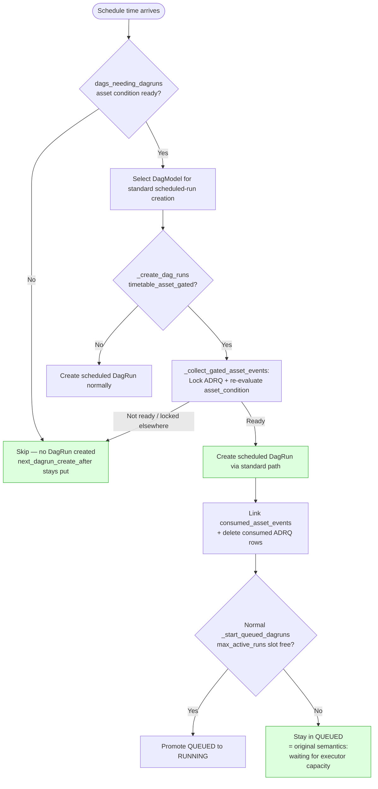

沒料到這系列可以出到 Part 3，這是我在 Airflow 挑戰的第一個無中生有的 feature，沒想到比想像中複雜一些。

原本的實作是先創造 placeholder QUEUED run 然後在 scheduler 裡無限 loop 等 asset 進才跑。用 dagrun_timeout -> FAILED 這樣hack的方式處理超時，破壞 DagRun 狀態機。

新版實作是 時間 + asset 兩個條件都到位後才建立 DagRun，靠 ADRQ composite PK 與 `next_dagrun_create_after` 不前進雙重防堆積，無 hack、不違反狀態機。

簡單來說就是 Gating 從「DagRun 建立之後」搬到「DagRun 建立之前」。

最新版 (2026.07.02) 又比早期新版更進一步：不再有獨立的 `_create_dag_runs_asset_gated` path，而是讓 asset-gated Dag 走標準 scheduled-run creation path (`_create_dag_runs`)。差別只是在 `_create_dag_runs` 裡，如果 `DagModel.timetable_asset_gated` 是 true，就先做一個通用的 asset gate step：lock ADRQ rows、re-check asset condition，成功後才繼續建立 scheduled DagRun。

## 新舊流程 mermaid 圖比較

+ 舊版流程

+ 新版流程

## 新流程的細節

+ `dags_needing_dagruns`
    + 用 timetable 的 `asset_triggered` / `asset_gated` behavioral flags 分流，不靠 `isinstance(AssetAndTimeSchedule)` 這種型別特判。
    + 對 asset-gated Dag 先用目前 ADRQ 狀態 evaluate `asset_condition`。如果 asset 還沒 ready，就不把這個 Dag 選進本輪 DagRun creation query。
    + 因為 `next_dagrun_create_after` 沒有被推進，這個 pending schedule slot 會留著，下個 scheduler loop 再檢查。

+ `_create_dagruns_for_dags`
    + 只把 asset-triggered Dags 分出去走 `_create_dag_runs_asset_triggered`。
    + asset-gated scheduled Dags 不再有專屬 `_create_dag_runs_asset_gated`，而是留在一般 scheduled Dag bucket，走標準 `_create_dag_runs`。

+ `_create_dag_runs`
    + 取 serialized Dag、檢查既有 DagRun、allowed run types 等標準 scheduled-run 流程都沿用原本邏輯。
    + 如果 `dag_model.timetable_asset_gated` 是 true，就呼叫 `_collect_gated_asset_events`。
    + `_collect_gated_asset_events` 會 lock 對應 ADRQ rows 並 re-check asset condition，避免多 scheduler 同時消費同一批 asset events。
    + re-check 失敗或 ADRQ row 被別的 scheduler lock/consume 時，直接 `continue`，不建立 DagRun，也不推進 `next_dagrun_create_after`。
    + re-check 成功後，繼續用標準 `_create_dag_runs` path 建立 `SCHEDULED` DagRun，然後把 consumed asset events link 到 DagRun，並刪除 consumed ADRQ rows。

+ 共用 helper
    + `_lock_queued_asset_records`、`_select_consumed_asset_events`、`_delete_consumed_asset_records` 這些 helper 也給 asset-triggered path 使用，所以 event provenance 與 consumption 邏輯不再是 asset-gated 專屬。

新流程的好處是用了較多原始airflow的機制，因此不需要一直 hack 去處理各種狀況。目前即使 Producer 跟 Consumer 不同步也能 handle。

+ Case A: Producer 10min 跑一次 / Consumer 20min 跑一次
| Time | Producer | Consumer | Note |
| --- | --- | --- | --- |
| T=00 | v | v | |
| T=10 | v | | 寫入 ADRQ |
| T=20 | v | v | T=20 的 AssetEvent 仍會寫入 `asset_event` table，但不會新增或更新既有 ADRQ row，因為 ADRQ 以 `(asset_id, target_dag_id)` 做 primary key，duplicate queue insert 會被忽略。建立 run 時會消費既有 ADRQ row，並用 event window 選出對應的 AssetEvents。 |
| T=30 | v | | |
| T=40 | v | v | |
| T=50 | v | | |
| T=00 | v | v | |

+ Case B: Producer 20min 跑一次 / Consumer 10min 跑一次
| Time | Producer | Consumer | Note |
| --- | --- | --- | --- |
| T=00 | v | v | 寫入 ADRQ + 建立 run |
| T=10 | | v | ADRQ 為空，因此不建立 run |
| T=20 | v | v | |
| T=30 | | v | |
| T=40 | v | v | |
| T=50 | | v | |
