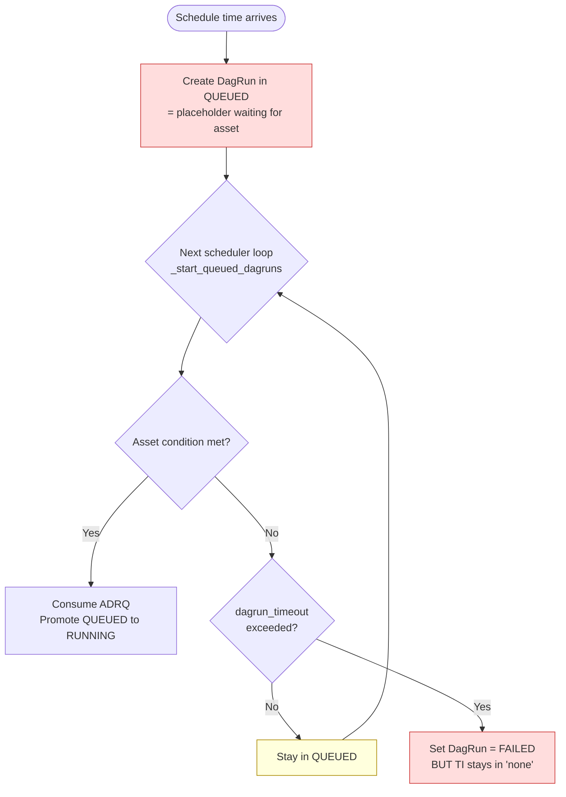
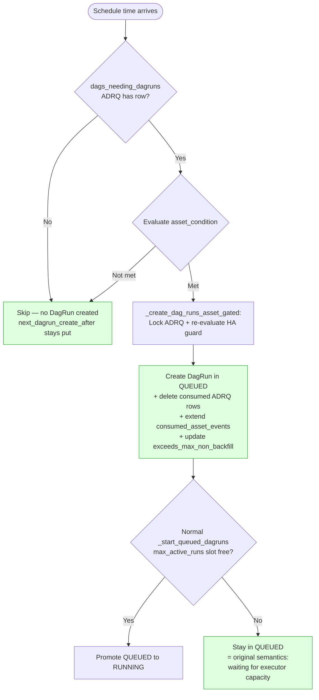

沒料到這系列可以出到 Part 3，這是我在 Airflow 挑戰的第一個無中生有的 feature，沒想到比想像中複雜一些。

原本的實作是先創造 placeholder QUEUED run 然後在 scheduler 裡無限 loop 等 asset 進才跑。用 dagrun_timeout -> FAILED 這樣hack的方式處理超時，破壞 DagRun 狀態機。

新版實作是 時間 + asset 兩個條件都到位後才建立 DagRun，靠 ADRQ composite PK 與 `next_dagrun_create_after` 不前進雙重防堆積，無 hack、不違反狀態機。

簡單來說就是 Gating 從「DagRun 建立之後」搬到「DagRun 建立之前」。

## 新舊流程 mermaid 圖比較

+ 舊版流程

+ 新版流程

## 新流程的細節

+ `_create_dag_runs_asset_gated`
    + 拿到候選 DagModel → 取 serialized Dag → lock 對應 queue rows → re-check asset condition → 建 DagRun → 消費 queue rows

新流程的好處是用了較多原始airflow的機制，因此不需要一直 hack 去處理各種狀況。目前即使 Producer 跟 Consumer 不同步也能 handle。

+ Case A: Producer 10min 跑一次 / Consumer 20min 跑一次
| Time | Producer | Consumer | Note |
| --- | --- | --- | --- |
| T=00 | v | v | |
| T=10 | v | | 寫入 ADRQ |
| T=20 | v | v | T=20 不會被寫入，因為 ADRQ 最多存一筆。建立 run，消費 T=10 寫的 ADRQ row，但 T=20 producer 的 AssetEvent 仍存在 asset_event table。 |
| T=30 | v | | |
| T=40 | v | v | |
| T=50 | v | | |
| T=00 | v | v | |

+ Case B: Producer 20min 跑一次 / Consumer 10min 跑一次
| Time | Producer | Consumer | Note |
| --- | --- | --- | --- |
| T=00 | v | v | 寫入 ADRQ + 建立 run |
| T=10 | | v | ADRQ 為空，因此不建立 run |
| T=20 | v | v | |
| T=30 | | v | |
| T=40 | v | v | |
| T=50 | | v | |
